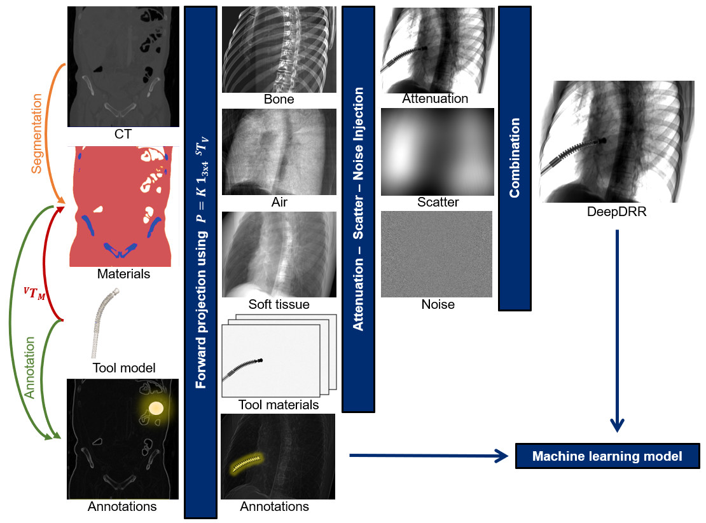
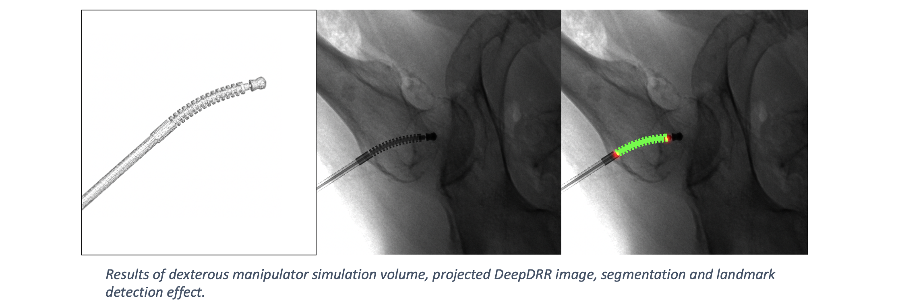

# `deepdrr`

`deepdrr` (note the lower-case) is an easy-to-use version of
[DeepDRR](https://github.com/mathiasunberath/DeepDRR). It's main advantage is being
`pip`-installable:

```bash
pip install deepdrr
```

The original README follows.

# DeepDRR
Implementation of our early-accepted MICCAI'18 paper "DeepDRR: A Catalyst for Machine Learning in Fluoroscopy-guided Procedures" and the subsequent Invited Journal Article in the IJCARS Special Issue of MICCAI "Enabling Machine Learning in X-ray-based Procedures via Realistic Simulation of Image Formation". 
The conference preprint can be accessed on arXiv here:  https://arxiv.org/abs/1803.08606.

Implemented in Python, PyCuda, and PyTorch.

### Introduction

DeepDRR aims at providing medical image computing and computer assisted intervention researchers state-of-the-art tools to generate realistic radiographs and fluoroscopy from 3D CTs on a trainingset scale. 


### Method Overview
To this end, DeepDRR combines machine learning models for material decomposition and scatter estimation in 3D and 2D, respectively, with analytic models for projection, attenuation, and noise injection to achieve the required performance. The pipeline is illustrated below. 



### Representative Results
The figure below shows representative radiographs generated using DeepDRR from CT data downloaded from the NIH Cancer Imaging Archive. Please find qualitative results in the **Applications** section.


### Applications - Pelvis Landmark Detection

We have applied DeepDRR to anatomical landmark detection in pelvic X-ray: "X-ray-transform Invariant Anatomical Landmark Detection for Pelvic Trauma Surgery", also early-accepted at MICCAI'18: https://arxiv.org/abs/1803.08608 and now with quantitative evaluation in the IJCARS Special Issue on MICCAI'18: https://link.springer.com/article/10.1007/s11548-019-01975-5. The ConvNet for prediction was trained on DeepDRRs of 18 CT scans of the NIH Cancer Imaging Archive and then applied to ex vivo data acquired with a Siemens Cios Fusion C-arm machine equipped with a flat panel detector (Siemens Healthineers, Forchheim, Germany). Some representative results on the ex vivo data are shown below.


### Applications - Metal Tool Insertion
DeepDRR has also been applied to simulate X-rays of the femur during insertion of dexterous manipulaters in orthopedic surgery: "Localizing dexterous surgical tools in X-ray for image-based navigation", which has been accepted at IPCAI'19: https://arxiv.org/abs/1901.06672. Simulated images are used to train a concurrent segmentation and localization network for tool detection. We found consistent performance on both synthetic and real X-rays of ex vivo specimens. The tool model, simulation image and detection results are shown below. 




### Potential Challenges - General 

1. Our material decomposition V-net was trained on NIH Cancer Imagign Archive data. In case it does not generalize perfectly to other acquisitions, the use of intensity thresholds (as is done in conventional Monte Carlo) is still supported. In this case, however, thresholds will likely need to be selected on a per-dataset, or worse, on a per-region basis since bone density can vary considerably.
2. Scatter estimation is currently limited to Rayleigh scatter and we are working on improving this. Scatter estimation was trained on images with 1240x960 pixels with 0.301 mm. The scatter signal is a composite of Rayleigh, Compton, and multi-path scattering. While all scatter sources produce low frequency signals, Compton and multi-path are more blurred compared to Rayleigh, suggesting that simple scatter reduction techniques may do an acceptable job. In most clinical products, scatter reduction is applied as pre-processing before the image is displayed and accessible. Consequently, the current shortcoming of not providing *full scatter estimation* is likely not critical for many applications, in fact, scatter can even be turned off completely. We would like to refer to the **Applications** section above for some preliminary evidence supporting this reasoning.
3. Due to the nature of volumetric image processing, DeepDRR consumes a lot of GPU memory. We have successfully tested on 12 GB of GPU memory but cannot tell about 8 GB at the moment. The bottleneck is volumetric segmentation, which can be turned off and replaced by thresholds (see 1.).
4. We currently provide the X-ray source sprectra from MC-GPU that are fairly standard. Additional spectra can be implemented in spectrum_generator.py. 
5. The current detector reading is *the average energy deposited by a single photon in a pixel*. If you are interested in modeling photon counting or energy resolving detectors, then you may want to take a look at mass_attenuation(_gpu).py to implement your detector.
6. Currently we do not support import of full projection matrices. But you will need to define K, R, and T seperately or use camera.py to define projection geometry online. 
7. It is important to check proper import of CT volumes. We have tried to account for many variations (HU scale offsets, slice order, origin, file extensions) but one can never be sure enough, so please double check for your files. 

### Potential Challenges - Tool Modeling

1. Currently, the tool/implant model must be represented as a binary 3D volume, rather than a CAD surface model. However, this 3D volume can be of different resolution than the CT volume; particularly, it can be much higher to preserve fine structures of the tool/implant. 
2. The density of the tool needs to be provided via hard coding in the file 'load_dicom_tool.py' (line 127). The pose of the tool/implant with respect to the CT volume requires manual setup. We provide one example origin setting at line 23-24.
3. The tool/implant will supersede the anatomy defined by the CT volume intensities. To this end, we sample the CT materials and densities at the location of the tool in the tool volume, and subtract them from the anatomy forward projections in detector domain (to enable different resolutions of CT and tool volume). Further information can be found in the IJCARS article.

### Running DeepDRR in Google Colaboratory

The codebase provided here was not developed with Google Colaboratory in mind, but our userbase has found small tweaks to the code to make it work in Colab. Kindly refer to https://github.com/mathiasunberath/DeepDRR/issues/6 and https://github.com/mathiasunberath/DeepDRR/issues/5 for the required changes. More guidance is available in https://github.com/mathiasunberath/DeepDRR/issues/13#issuecomment-614246840.

## Reference

We hope this proves useful for medical imaging research. If you use our work, we would kindly ask you to reference our work. 
Our MICCAI article covers the basic DeepDRR pipeline and task-based evaluation:
```
@inproceedings{DeepDRR2018,
  author       = {Unberath, Mathias and Zaech, Jan-Nico and Lee, Sing Chun and Bier, Bastian and Fotouhi, Javad and Armand, Mehran and Navab, Nassir},
  title        = {{DeepDRR--A Catalyst for Machine Learning in Fluoroscopy-guided Procedures}},
  date         = {2018},
  booktitle    = {Proc. Medical Image Computing and Computer Assisted Intervention (MICCAI)},
  publisher    = {Springer},
}
```
Our IJCARS paper describes the integration of tool modeling and provides quantitative results:
```
@article{DeepDRR2019,
  author       = {Unberath, Mathias and Zaech, Jan-Nico and Gao, Cong and Bier, Bastian and Goldmann, Florian and Lee, Sing Chun and Fotouhi, Javad and Taylor, Russell and Armand, Mehran and Navab, Nassir},
  title        = {{Enabling Machine Learning in X-ray-based Procedures via Realistic Simulation of Image Formation}},
  year         = {2019},
  journal      = {International journal of computer assisted radiology and surgery (IJCARS)},
  publisher    = {Springer},
}
```


### Instructions for Windows:

**Download segmentation network weights**
* Due to file size limitations, please download the segmentation network weights from https://www.dropbox.com/s/pn4aw4z2i01eoo4/model_segmentation.pth.tar?dl=0.
* Place the file "model_segmentation.pth.tar" in the DeepDRR source folder.

**Install CUDA 8.0**
1. ```conda create -n pytorch python=3.6```
2. ```activate pytorch```

**Install packages**
1. Numpy+MKL from https://www.lfd.uci.edu/~gohlke/pythonlibs/#numpy
2. ```conda install matplotlib```
3. ```conda install -c conda-forge pydicom```
4. ```conda install -c anaconda scikit-image```
5. ```pip install pycuda```
6. ```Pip install tensorboard```
7. ```Pip install tensorboardX```

**Install pytorch**
1. Follow [peterjc123's scripts to run PyTorch on Windows](https://github.com/peterjc123/pytorch-scripts "peterjc123 PyTorch").
2. ```conda install -c peterjc123 pytorch```
3. ```pip install torchvision```

**Getting started**
* The script example_projector.py implements a complete pipeline for data generation.
  
**PyCuda not working?**
* Try to add C compiler to path. Most likely the path is: “C:\Program Files (x86)\Microsoft Visual Studio 14.0\VC\bin\”.

## Acknowledgments
CUDA Cubic B-Spline Interpolation (CI) used in the projector:  
https://github.com/DannyRuijters/CubicInterpolationCUDA  
D. Ruijters, B. M. ter Haar Romeny, and P. Suetens. Efficient GPU-Based Texture Interpolation using Uniform B-Splines. Journal of Graphics Tools, vol. 13, no. 4, pp. 61-69, 2008.  

The projector is a heavily modified and ported version of the implementation in CONRAD:  
https://github.com/akmaier/CONRAD  
A. Maier, H. G. Hofmann, M. Berger, P. Fischer, C. Schwemmer, H. Wu, K. Müller, J. Hornegger, J. H. Choi, C. Riess, A. Keil, and R. Fahrig. CONRAD—A software framework for cone-beam imaging in radiology. Medical Physics 40(11):111914-1-8. 2013.  

Spectra are taken from MCGPU:  
A. Badal, A. Badano, Accelerating Monte Carlo simulations of photon transport in a voxelized geometry using a massively parallel graphics processing unit. Med Phys. 2009 Nov;36(11): 4878–80.  

The segmentation pipeline is based on the Vnet architecture:  
https://github.com/mattmacy/vnet.pytorch  
F. Milletari, N. Navab, S-A. Ahmadi. V-Net: Fully Convolutional Neural Networks for Volumetric Medical Image Segmentation. arXiv:160604797. 2016.

We gratefully acknowledge the support of the NVIDIA Corporation with the donation of the GPUs used for this research.
